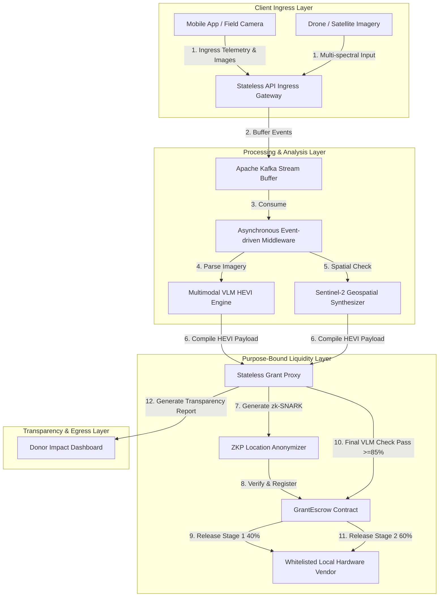

# Project Astraea: Systems Architecture Blueprint
## B2G/G2C Public Grant Allocation & Purpose-Bound Liquidity Architecture

This document outlines the end-to-end systems architecture for **Project Astraea**, transitioned from commercial property tokenization to an institutional **B2G/G2C Public Grant Allocation and Purpose-Bound Liquidity Framework**. This infrastructure maps multi-modal geospatial and VLM data to public grant escrow vaults, ensuring zero cost to local residents while securing automated, milestone-verified direct settlement to material suppliers.

---

## 1. Refactored System Topology & Data Flow

Project Astraea utilizes a decentralized, stateless event processing architecture designed to isolate funds, verify constructions, and report impact metrics transparently:

---

## 2. Global Standard Metrics for Ingestion (`PA-TECH-001`)

To determine project prioritization and grant allocations, the **Multimodal VLM HEVI Engine** evaluates four standardized, quantitative parameters from smartphone and drone imagery:

1.  **Roofing Condition Metrics**: Pixel-level analysis of structural wear, rotting support beams, sagging, and material identification (e.g., canvas sheets, weathered timber, corrugated iron, concrete slab, or toxic asbestos panels).
2.  **Water & Sanitation Ingress**: Estimation of clean drinking water accessibility, distance to contaminated surface runoffs/waste piles, and internal kitchen/living water vulnerability indexes.
3.  **Sanitary Latrine Structural Metrics**: Visual confirmation of segregated toilet infrastructure, closed drainage connections, and septic tank integration to prevent pathogen exposure.
4.  **Floor Composition Score**: Numerical assessment of floor materials, distinguishing raw dirt floors from concrete, tile, or raised wood. Dictates the statistical risk of parasite transmission and moisture-borne infection vectors.

---

## 3. Purpose-Bound Liquidity Layer & Grant Escrow

The core financial framework transitions entirely from debt instruments to a **Purpose-Bound Liquidity Escrow**:

*   **ERC-4626 Adjacent Escrow Pools**: Public and philanthropic organizations (e.g., UN-Habitat, Green Climate Fund) deposit stablecoin grants (USDC) into the `GrantEscrow` contract.
*   **Direct Settlement Enforcement**: Under no circumstances can local residents withdraw or claim stablecoins into their individual Externally Owned Accounts (EOAs). This design completely eliminates cash diversion risk.
*   **Whitelisted Hardware Vendors**: Funds are routed exclusively to local material suppliers registered on-chain by the platform's governance. When a housing upgrade is approved, the contract releases a 40% down payment to the designated supplier to dispatch construction materials.
*   **Post-Upgrade VLM Verification**: The remaining 60% balance is held in escrow until the resident uploads a post-reconstruction photo. The VLM verifies the structural improvements. If the AI verification score meets or exceeds the **85% threshold**, the escrow contract automatically releases the final payment to the supplier.

---

## 4. Zero-Knowledge Location Anonymization

To protect vulnerable populations from predatory slum-lords or targeted evictions, the system enforces a strict location privacy protocol:
1.  **H3 Spatial Indexing**: Latitude and longitude coordinate pairs are hashed to a coarse H3 index (Resolution 12) at the edge boundary.
2.  **ZK-SNARK Verification**: A zk-SNARK circuit proves spatial location and containment within the grant allocation zone without exposing the resident's name, precise coordinates, or raw visual files on the public Layer-2 ledger (Polygon/Arbitrum).
