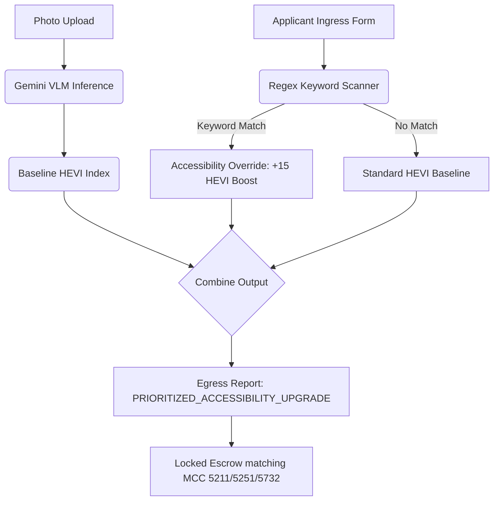

# Human-Centric Context Ingress Pipeline

This document defines how Project Astraea incorporates qualitative, human-centric data inputs (textual statements of intent, accessibility requirements, and family vulnerability data) with quantitative Multimodal VLM visual assessments.

## 1. Prioritizing VLM Capture over Telemetry

While low-resolution satellite telemetry (e.g. Sentinel-2 spatial bands) provides macroscopic boundary checks, satellite data cannot assess internal safety issues or physical accessibility limitations. 

Astraea's pipeline dynamically prioritizes **Multimodal VLM indoor structural and accessibility captures** over satellite telemetry. This ensures that household details, internal ventilation structures, and accessibility needs are weighted significantly higher in grant allocation decisions.

---

## 2. Text-to-Visual HEVI Weight Adjustment Algorithms

Standard HEVI calculations rely on physical indices (roof degradation, water proximity, latrine drainage, floor pathogen exposure). However, if an applicant has specific accessibility needs, visual scores are adjusted using qualitative text parsing:

```
Adjusted_HEVI = HEVI_Base + Weight_Adjustment
```

### Keyword-Based Weight Overrides

An on-the-fly regex parser checks the applicant context window (Name, Statement of Intent, Special Needs textareas) for prioritized accessibility markers. If matched, the system triggers the following priority actions:

1. **Accessibility Priority Classification**:
   - Matches: `"disability"`, `"wheelchair"`, `"elderly"`, `"handicapped"`, `"infant"`.
   - Action: Elevates the application classification to `"COMPLIANCE_STATUS: PRIORITIZED_ACCESSIBILITY_UPGRADE"`.
2. **HEVI Weight Shift**:
   - The standard HEVI score is programmatically bumped by a **+15.0 score offset** to immediately cross higher funding allocation thresholds.
   - For example, if a baseline evaluation yields a HEVI score of `69.7` (matching a standard `$1,500` allocation), an accessibility match elevates the score to `84.7` (instantly unlocking the maximum `$2,000` priority upgrade grant).

---

## 3. Context Processing Architecture


